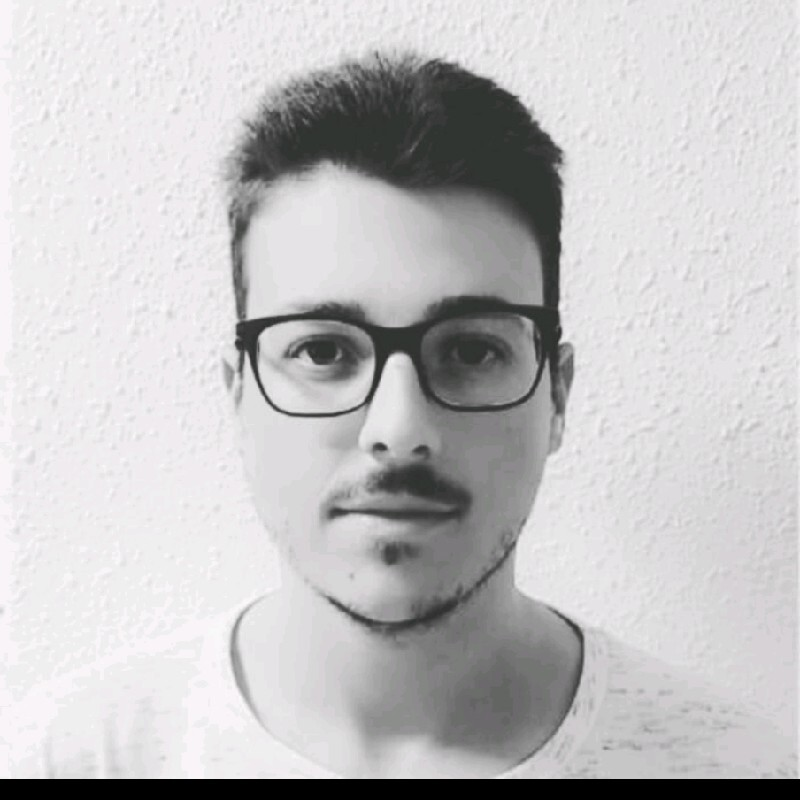

## **Presentacion**

Me llamo **Antonio Sánchez Bustos**, Tengo 24 años vengo del Grado superior de Sistemas microinfoormatico y redes.

Hice el primer año de **_Desarrollo de aplicaciones multiplataforma_** pero no lo terminé.

Me meti en este grado por que siempre me ha gustado la informatica pero en el Grado superior de DAM me vi saturado y me costaba mucho entenderlo y no habia manera y desisti tras 2 años de intentarlo y me meti aqui por que lo que se me atrancaba era la programacion.

Sobre mis conocimientos en esta asignatura he visto de lenguaje de marcas los siguientes:

-**XML** y **XSD**.

-**HTML** y **CSS**.

-**Xquery**.

-**Boostrap**.

Ademas se lo basico de Programas en java ya en orientacion a objetos es cuando me pierdo.

Mis gustos son basicos me gustan los **_videojuegos_**, el tema de la ropa, me gusta mucho el cine y sobre todo viajar con mis amigos, Tambien me gusta mucho el tema del anime y manga.

#### **Mis Metas**

Seria poder terminar el grado para poder empezar en el mundo laboral por que con el grado medio no he podido y como he dicho antes me gusta bastante trabajar en un entorno informatico y a poder ser telematico.

#### **Link**
[**Linkedin**](https://www.linkedin.com/in/antonio-s%C3%A1nchez-bustos-291302269/)